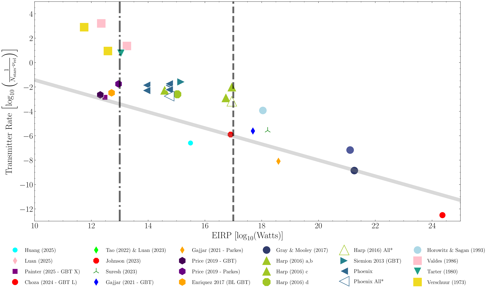

# SETI-EIRP Comparison Plot Generator 👽📡
[[](https://doi.org/10.1234/abcd.efgh)](https://doi.org/10.5281/zenodo.17789734)

This package provides a command-line tool and Python library for plotting historical and modern SETI survey limits in the EIRP–rarity parameter space, as seen in most recent SETI survey papers. As shown below! 



## Installation

You can install the package using pip:

```
git clone https://github.com/ojohnson/SETI-EIRP-Comparison-Plot.git
cd SETI-EIRP-Comparison-Plot
pip install -e . 
```
An editable install (`-e`) is recommended for changing the plot itself as the style will be specific to each use case. 

## Usage
The most basic usage is to run the command-line tool with the default survey data:

```
seti-eirp --no-show
```
This will generate a plot using the default `surveys.yaml` file included in the package, and save it in the current working directory without displaying it. To see further more basic options, run `seti-eirp -h`.

```
options:
  -h, --help            show this help message and exit
  -i INPUT, --input INPUT
                        Input YAML file with survey definitions (default: surveys.yaml)
  -o OUTPUT, --output OUTPUT
                        Output filename for the plot (default: SETI-EIRP-limits-Comp.pdf)
  -pub, --publish       Format the plot for publication using scienceplots.
  --twocolumn           Format the plot for two-column layout.
  --no-show             Do not display the plot interactively.
  ```

## Calculating or adding new surveys via `.yaml`

There are two means to add survey data to the plot, either by calculating the EIRP and rarity values manually, or by using the built-in calculator. 

1. Computed Surveys: To use the built-in calculator, add a new survey entry to the `surveys.yaml` file with the required parameters (e.g., dish diameter, system temperature, bandwidth, etc.). The script will compute the EIRP and rarity values based on these inputs.

```
- name: "Example Survey (2000)"
  point_type: "computed"
  N_stars: 500
  band_Hz: 100000000.0
  central_freq_Hz: 1500000000.0
  dish_diam_m: 64
  dish_Tsys_K: 35
  aperture_efficiency: 0.7
  SNR_threshold: 10
  spectral_resolution_Hz: 1.0
  obs_time_s: 300
  instantaneous_bandwidth_Hz: 1000000
  max_distance_ly: 300
  npol: 2
  narrow: false
  marker: "o"
  color: "red"
  markersize: 16
```

2. Fixed Surveys: To add a survey with pre-calculated EIRP and rarity values, use the `fixed` point type and provide the `logEIRP` and `logRarity` fields directly. These appear exactly where specified in the scatter plot

```
- name: "Johnson et al. (2023)"
  point_type: "fixed"
  logEIRP: 16.9
  logRarity: -5.8
  marker: "*"
  color: "lime"
  edgecolor: "black"
  markersize: 18
```

## References

There is also an included `surveys.bib` file with as many of the relevant references as I could gather for the surveys included in the default `surveys.yaml`. Please cite appropriately if you use this code or the resulting plots in your work! Also feel free to open a PR if you want your survey added to the default list.
